# 🎓 Institute FAQ Chatbot

A smart, NLP-powered chatbot that answers frequently asked questions about an educational institute. Built with **Flask**, **HTML/CSS/JS**, and **scikit-learn**.


---

## ✨ Features

| # | Feature | Description |
|---|---------|-------------|
| 1 | **Basic FAQ Responder** | Rule-based chatbot answering 15 fixed institute FAQs (timings, fees, contacts, etc.) |
| 2 | **Text Preprocessing** | Lowercasing, tokenization, stopword removal, punctuation handling & spelling normalization |
| 3 | **Synonym-Aware Matching** | Semantically similar queries ("fees", "tuition", "payment") map to the same answer via synonym dictionary |
| 4 | **TF-IDF Retrieval** | Retrieval-based FAQ selection using TF-IDF vectorization and cosine similarity |
| 5 | **Intent Classification** | Routes queries to 7 intent buckets: admissions, exams, timetable, hostel, scholarships, facilities, general |
| 6 | **Entity Extraction** | Regex-based extraction of dates, course codes (CS101), and semester/year numbers from queries |
| 7 | **Context Handling** | Multi-turn conversation support — follow-up queries inherit context from previous turns |
| 8 | **Fallback & Handover** | 3-tier strategy: suggest similar FAQs → ask clarification → route to human advisor |

---

## 🖥️ Screenshots

<p align="center">
  
</p>

> _Dark-themed glassmorphism UI with intent badges, confidence scores, and entity chips._

---

## 🚀 Getting Started

### Prerequisites

- Python 3.9 or higher
- pip (Python package manager)

### Installation

```bash
# 1. Clone the repository
git clone https://github.com/your-username/faq-chatbot.git
cd faq-chatbot

# 2. Install dependencies
pip install -r requirements.txt

# 3. Run the application
python app.py
```

### Usage

Open your browser and navigate to:

```
http://localhost:5000
```

Type a question or click a topic chip to get started!

---

## 📁 Project Structure

```
faq-chatbot/
├── app.py                  # Flask application (main entry point)
├── faq_data.py             # 15 FAQs with keywords, intents & synonyms
├── preprocessor.py         # Text preprocessing pipeline
├── synonym_matcher.py      # Synonym-aware keyword matching
├── tfidf_retriever.py      # TF-IDF retrieval engine
├── intent_classifier.py    # Intent classification (7 intents)
├── entity_extractor.py     # Entity extraction (dates, courses, semesters)
├── context_manager.py      # Multi-turn conversation state manager
├── fallback_handler.py     # Fallback & human handover strategy
├── requirements.txt        # Python dependencies
├── templates/
│   └── index.html          # Chat UI template
└── static/
    ├── style.css           # Dark-themed glassmorphism styles
    └── script.js           # Client-side chat logic
```

---

## 🧠 How It Works

```mermaid
flowchart TD
    A[User Query] --> B[Greeting Check]
    B -->|Greeting| C[Return Greeting]
    B -->|Not Greeting| D[Preprocess Text]
    D --> E[Extract Entities]
    D --> F[Classify Intent]
    E & F --> G[Resolve Follow-ups via Context]
    G --> H[TF-IDF Retrieval]
    G --> I[Synonym Matching]
    H & I --> J{Confidence ≥ Threshold?}
    J -->|Yes| K[Return FAQ Answer + Metadata]
    J -->|No| L[Fallback Handler]
    L --> M[Suggest Similar FAQs]
    L --> N[Ask Clarification]
    L --> O[Route to Human Advisor]
```



### Processing Pipeline

1. **Greeting Detection** — Checks if the input is a greeting (hi, hello, thanks, bye)
2. **Preprocessing** — Lowercases, removes punctuation/stopwords, fixes spelling
3. **Entity Extraction** — Pulls out dates, course codes (`CS101`), semesters (`SEM 5`)
4. **Intent Classification** — Scores query against 7 intent keyword sets
5. **Context Resolution** — For short follow-ups, merges with previous conversation state
6. **Dual Retrieval** — Runs both TF-IDF cosine similarity and synonym-expanded keyword matching
7. **Response Selection** — Picks the highest-confidence match; falls back if confidence is low

---

## 💬 Example Queries

| Query | What Happens |
|-------|-------------|
| `What are the college timings?` | Direct keyword match → timings FAQ |
| `How much is the tuition?` | Synonym "tuition" → mapped to "fees" FAQ |
| `When is SEM 5 CS exam?` | Extracts entities (Sem 5, CS) + returns exam schedule |
| `What about hostel?` _(follow-up)_ | Context from previous turn inherited |
| `asdfgh random` | Fallback → human advisor contact info |

---

## 🛠️ Tech Stack

- **Backend:** Python, Flask
- **NLP:** scikit-learn (TF-IDF), regex, custom preprocessing
- **Frontend:** HTML5, CSS3 (glassmorphism dark theme), Vanilla JavaScript
- **State Management:** Flask sessions for conversation context

---

## 📋 FAQ Topics Covered

| Topic | Intent |
|-------|--------|
| College Timings | general |
| Tuition Fees | admissions |
| Contact Information | general |
| Admission Process | admissions |
| Exam Schedule | exams |
| Class Timetable | timetable |
| Hostel Facilities | hostel |
| Scholarships | scholarships |
| Library | facilities |
| Placements | facilities |
| Sports | facilities |
| Transport / Bus | facilities |
| Campus Wi-Fi | facilities |
| Canteen / Food | facilities |
| Anti-Ragging Policy | general |

---

## 🤝 Contributing

1. Fork the repository
2. Create a feature branch (`git checkout -b feature/new-feature`)
3. Commit your changes (`git commit -m 'Add new feature'`)
4. Push to the branch (`git push origin feature/new-feature`)
5. Open a Pull Request

---

## 📄 License

This project is licensed under the MIT License — see the [LICENSE](LICENSE) file for details.

---

## 👤 Author

**Adarsh Mahant**

---

<p align="center">
  Made with ❤️ for students everywhere
</p>
